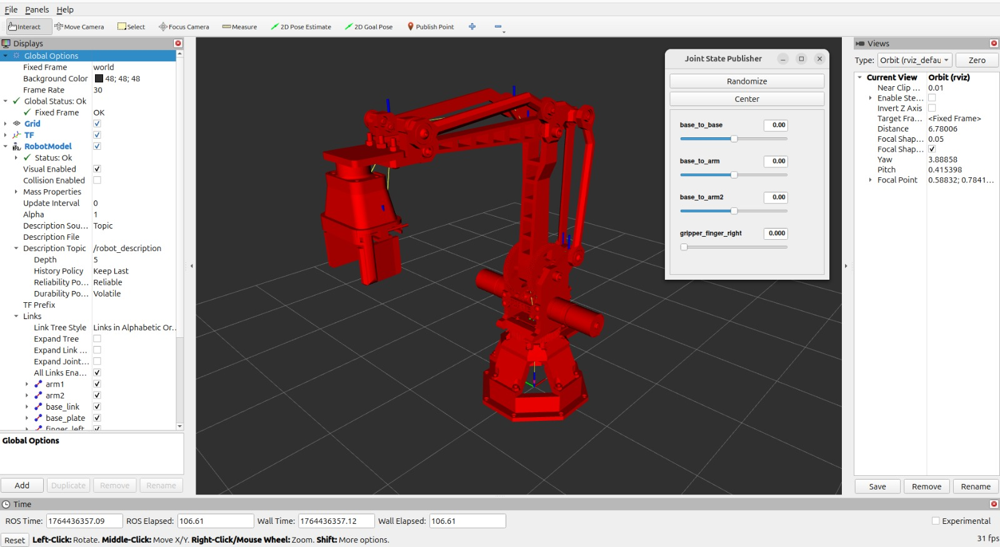
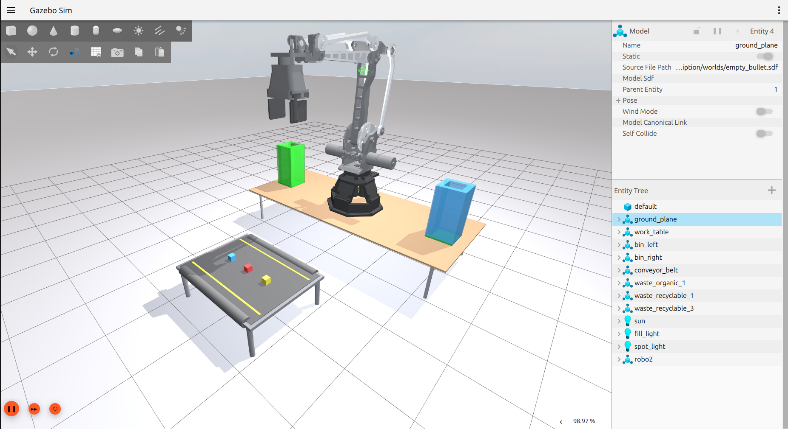
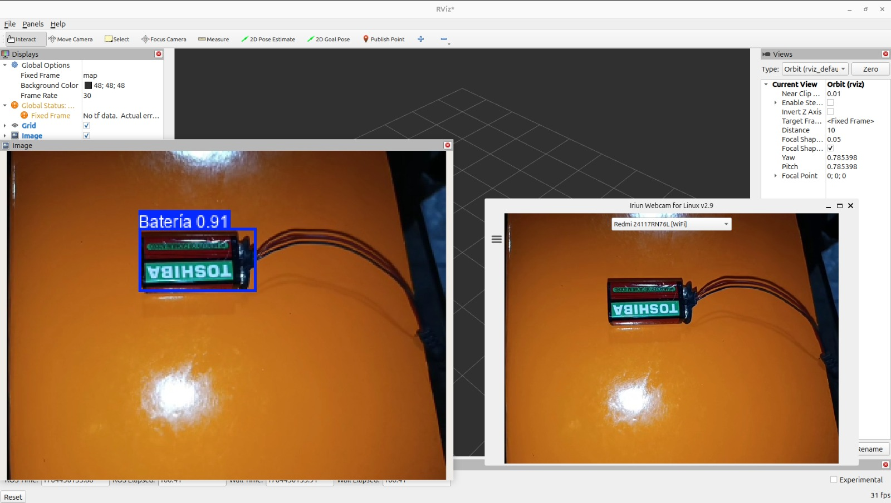
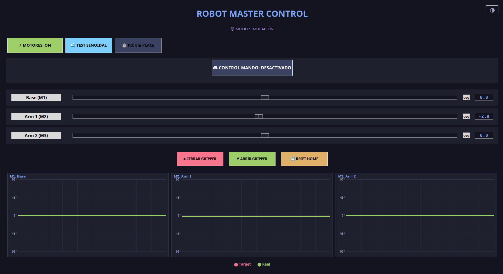

# VIPER: Robotic Arm for Electronic Waste (E-Waste) Classification

VIPER is a robotic ecosystem developed in **ROS 2 Jazzy**, designed for automated *Pick and Place* tasks. The project integrates advanced mechanical design, a high-fidelity simulation acting as a digital twin, and a perception system based on **YOLOv11** specifically trained for the detection and classification of electronic components.

<div align="center">
  
  
  <p><em>Real-time system operation snippets.</em></p>
</div>

---

## 🚀 Key Features

### 1. Mechanical Design and URDF
The arm features a kinematic design optimized for parallelograms, allowing it to maintain the end-effector's orientation. The model is defined using modular **Xacro** files, including:
*   **Mimic Joints:** Advanced joint configurations to model the behavior of parallel links.
*   **STL Meshes:** High-precision geometries for collisions and visualization.
*   **Inertial Properties:** Calculated physical properties for a realistic dynamic response.

<div align="center">
  
  <p><em>URDF model visualization in RViz2.</em></p>
</div>

### 2. Gazebo Simulation (Digital Twin)
Utilizing **Gazebo Sim (Harmonic)** and the **Bullet** physics engine, the simulation serves as an exact digital twin of the physical hardware.
*   **ros2_control:** Implementation of `gz_ros2_control` for managing hardware interfaces.
*   **Controllers:** Use of `JointStateBroadcaster` and `ForwardCommandController` (Position) for precise control.
*   **Synchronization:** Commands sent to the simulation can be replicated on the physical arm via serial communication (ESP32).

<div align="center">
  
  <p><em>Simulation environment with the arm and recycling bins.</em></p>
</div>

### 3. Perception with YOLOv11 in ROS 2
The vision system employs a custom **YOLOv11** neural network trained to identify three critical waste classes:
*   **Battery**
*   **Motor**
*   **PCB (Circuit Board)**

**Perception Nodes & Topics:**
*   `/yolo/annotated_image`: Image stream with overlaid *bounding boxes* and labels.
*   `/yolo/object_position`: `geometry_msgs/Point` containing the centroid coordinates (X, Y) for pick trajectory calculation.
*   `/yolo/object_class`: `std_msgs/String` indicating the detected class name.

<div align="center">
  
  <p><em>Electronic component detection using YOLOv11.</em></p>
</div>

### 4. Control Interface (GUI)
An operator interface developed for manual monitoring and control, allowing for joint angle adjustments and intuitive gripper activation.

<div align="center">
  
  <p><em>Operator control panel.</em></p>
</div>

---

## 🛠️ Tech Stack
*   **OS:** Ubuntu 24.04 LTS
*   **Middleware:** ROS 2 Jazzy Jalisco
*   **Simulator:** Gazebo Harmonic (GZ Sim)
*   **Computer Vision:** YOLOv11 (Ultralytics)
*   **Languages:** Python 3, C++
*   **Hardware Sync:** Micro-ROS / Serial Communication (ESP32)

---

## 📂 Repository Structure
*   `src/robot_description`: URDF/Xacro files, STL meshes, and Gazebo world configurations.
*   `src/robo2_controller`: `ros2_control` configuration, controller parameters, and trajectory nodes.
*   `src/robo2_moveit`: (Optional) Configuration for complex motion planning.

---

## 🔧 Installation and Execution

1.  **Clone the repository:**
    ```bash
    mkdir -p ~/viper_ws/src
    cd ~/viper_ws/src
    git clone https://github.com/your-user/viper.git
    ```
2.  **Install dependencies:**
    ```bash
    cd ~/viper_ws
    rosdep install --from-paths src --ignore-src -r -y
    ```
3.  **Build:**
    ```bash
    colcon build --symlink-install
    source install/setup.bash
    ```
4.  **Launch Simulation:**
    ```bash
    ros2 launch robot_description gazebo.launch.py
    ```
5.  **Launch Controllers:**
    ```bash
    ros2 launch robo2_controller controller.launch.py
    ```
